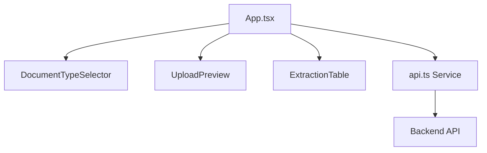

# Intelli Extract - Technical Documentation

## 1. Project Overview
Intelli Extract is an AI-powered document extraction and verification system. It allows users to upload various document types (Passport, Voter ID, Aadhaar, etc.) and uses multiple AI models to extract fields, compare results, and provide a confidence score for each attribute.

## 2. Tech Stack
- **Frontend**: React 19, Vite, TypeScript
- **UI Framework**: Material UI (MUI) v7
- **Animations**: Framer Motion
- **Styling**: Vanilla CSS & MUI System
- **Containerization**: Docker

## 3. Architecture & Component Hierarchy

### Component Flow
The application follows a modular architecture where state is managed at the top-level `App` component and passed down to specialized components.



- **App.tsx**: The orchestrator. Manages `selectedType`, `uploadedFile`, `extractionResults`, and `isProcessing` states.
- **DocumentTypeSelector.tsx**: Handles the selection of the document category (e.g., Passport).
- **UploadPreview.tsx**: Manages file selection and displays a preview of the uploaded image.
- **ExtractionTable.tsx**: Displays the comparison of results from different models (M1, M2, M3) and their consensus scores.

## 4. Data Flow & State Management

1. **Selection**: User selects a document type in `DocumentTypeSelector`. This updates the `selectedType` state in `App.tsx` and clears any previous results.
2. **Upload**: User uploads a file via `UploadPreview`. This triggers the `handleFileUpload` function.
3. **Processing**: `App.tsx` calls the `uploadDocument` service in `api.ts`.
4. **Acquisition**: The API service sends a `POST` request with `multipart/form-data` containing the file and `doc_type`.
5. **Transformation**: The raw API response is transformed into a flat `ExtractionResult[]` array by `transformApiResponse` to make it easy for the UI to render.
6. **Visualization**: `ExtractionTable` receives the data and renders rows dynamically, applying color-coded badges based on the confidence score.

## 5. Environment Variables
The project uses Vite-style environment variables for configuration. These are essential for connecting the frontend to the correct backend services.

### Required Variables
| Variable | Description | Example Value |
|----------|-------------|---------------|
| `VITE_API_BASE_URL` | The base URL for the backend extraction API. | `http://172.168.1.205:31192/api/v1/compare` |

### Configuration Methods
- **Local Development**: Create a `.env` file in the project root. Vite automatically loads variables prefixed with `VITE_`.
- **Docker Builds**: Variables must be passed during the build process using `--build-arg`, as they are injected into the client-side bundle at build time.

---

## 6. Docker Configuration
The project is containerized using a `Dockerfile` that handles the build process and serves the static assets.

### Dockerfile Breakdown
The `Dockerfile` performs the following steps:
1. **Base Image**: Uses `node:20-alpine` for a lightweight build environment.
2. **Build Arguments**: Defines `ARG VITE_API_BASE_URL` to accept the API endpoint during image construction.
3. **Environment Injection**: Sets `ENV VITE_API_BASE_URL=$VITE_API_BASE_URL` so the Vite build process can access it.
4. **Dependency Installation**: Copies `package.json` and runs `npm ci` for clean, reproducible installs.
5. **Build**: Executes `npm run build` to generate the production-ready `dist` folder.
6. **Serving**: Installs the `serve` package globally and exposes port `5173`.
7. **Execution**: Starts the server using `serve -s dist -l 5173`.

---

## 7. Development Setup
To run the project locally without Docker:

1. **Install Dependencies**:
   ```bash
   npm install
   ```
2. **Environment Setup**:
   Ensure a `.env` file exists with `VITE_API_BASE_URL`.
3. **Start Dev Server**:
   ```bash
   npm run dev
   ```

---

## 8. API Integration Details
The frontend communicates with a backend endpoint that returns a `confidence_matrix` and `extractions` for three models (`M1`, `M2`, `M3`).

- **Endpoint**: Defined by `${VITE_API_BASE_URL}`.
- **Method**: `POST`.
- **Payload**: `FormData` containing the file and `doc_type`.
- **Key Logic**: The `transformApiResponse` function in `api.ts` maps the matrix scores and extraction values into a unified UI model.
