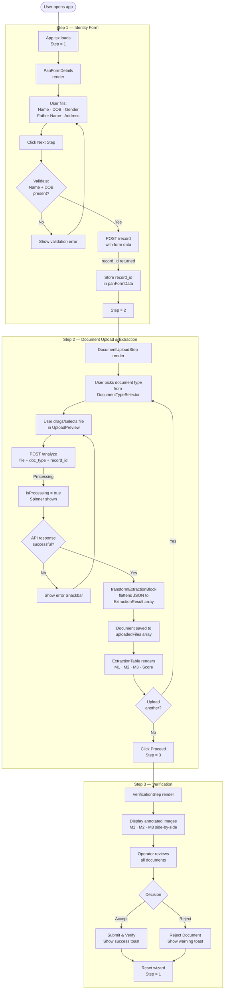

# Intelli Extract — Technical Documentation

> **Version:** 1.0  |  **Stack:** React 19 · TypeScript · MUI v7 · Vite 7  |  **Last Updated:** May 2026

---

## Table of Contents

1. [Project Overview](#1-project-overview)
2. [Technology Stack](#2-technology-stack)
3. [Project Structure](#3-project-structure)
4. [Application Architecture](#4-application-architecture)
5. [Step-by-Step User Flow](#5-step-by-step-user-flow)
6. [Component Reference](#6-component-reference)
7. [State Management](#7-state-management)
8. [Data Models & Types](#8-data-models--types)
9. [API Integration](#9-api-integration)
10. [Design System & Theme](#10-design-system--theme)
11. [Deployment & Environment Setup](#11-deployment--environment-setup)
12. [Development Guide](#12-development-guide)

---

## 1. Project Overview

**Intelli Extract** is an AI-powered document extraction and verification web application. It acts as a smart front-end portal that walks users through a guided three-step process:

1. **Capture** the user's personal details (PAN form fields).
2. **Upload** one or more identity documents (Passport, Aadhaar, Voter ID, etc.) for AI analysis.
3. **Verify** the extracted results by comparing the outputs of three independent AI models side by side.

The core value of the system is its **multi-model consensus approach**. Instead of relying on a single OCR or AI model, every document is processed by three separate models (referred to as **M1**, **M2**, and **M3**). Each model independently extracts named attributes from the document image. The backend then computes a confidence score per attribute based on how well the three models agree with each other. A final human operator reviews the side-by-side annotated images and either accepts or rejects the extraction.

### Key Capabilities

| Capability | Description |
|---|---|
| Multi-step wizard UI | Guides users through data entry, upload, and review in a structured flow |
| Multi-model extraction | Three AI models analyze every document independently |
| Consensus scoring | Per-attribute confidence score computed from model agreement |
| Annotated image review | Side-by-side display of model-annotated document images |
| Multi-document sessions | Upload and compare multiple documents in one session |
| Real-time feedback | Loading states, success toasts, and error alerts throughout |
| Responsive layout | Works across desktop and tablet screen sizes |

---

## 2. Technology Stack

### Frontend

| Layer | Library / Tool | Version |
|---|---|---|
| UI Framework | React | 19.2.0 |
| Language | TypeScript | ~5.9.3 |
| Build Tool | Vite (with SWC) | 7.2.4 |
| Component Library | Material UI (MUI) | 7.3.7 |
| Styling Engine | Emotion (`@emotion/react`, `@emotion/styled`) | Bundled with MUI |
| Icon Set | MUI Icons Material | 7.3.7 |
| Animation | Framer Motion | 12.31.0 |
| Date Utilities | Day.js | 1.11.20 |
| Date Picker | MUI X Date Pickers | 9.0.2 |

### Infrastructure

| Layer | Tool |
|---|---|
| Containerization | Docker (node:20-alpine base) |
| Static Server | `serve` (inside Docker) |
| HTTP Client | Native `fetch` API |

---

## 3. Project Structure

```
Intelli_Extract/
│
├── public/
│   └── env-config.js            Runtime environment variable injection
│
├── src/
│   ├── main.tsx                 React application entry point
│   ├── App.tsx                  Root wizard orchestrator component
│   ├── App.css                  Legacy placeholder styles
│   ├── index.css                Global styles, scrollbar theming
│   ├── theme.ts                 MUI dark theme configuration
│   ├── types.ts                 All TypeScript interfaces and types
│   ├── vite-env.d.ts            Vite environment type declarations
│   │
│   ├── services/
│   │   └── api.ts               API calls, response transformation
│   │
│   └── components/
│       ├── PanFormDetails.tsx       Step 1 — User identity form
│       ├── DocumentUploadStep.tsx   Step 2 — Upload + extraction results
│       ├── VerificationStep.tsx     Step 3 — Model comparison & review
│       ├── DocumentTypeSelector.tsx Reusable — Document type picker
│       ├── UploadPreview.tsx        Reusable — Drag-drop file upload zone
│       └── ExtractionTable.tsx      Reusable — Results comparison table
│
├── index.html                   HTML shell, loads env-config.js
├── vite.config.ts               Vite build configuration
├── tsconfig.json                Root TypeScript config
├── tsconfig.app.json            App-specific TS settings (strict, ES2022)
├── Dockerfile                   Container build & serve instructions
├── .env                         Local environment variables
└── package.json                 Dependencies and npm scripts
```

---

## 4. Application Architecture

### High-Level Architecture

The application follows a **centralized orchestrator pattern**. A single top-level component (`App.tsx`) owns all application state and passes data and callbacks down to child components as props. This avoids the complexity of a global state library for an application of this scope.

```
┌─────────────────────────────────────────────────────────┐
│                      App.tsx (Orchestrator)             │
│                                                         │
│  State: step, panFormData, uploadedFiles, activeDocId   │
│         extractionResults, isProcessing, error          │
│                                                         │
│  ┌─────────────┐  ┌──────────────────┐  ┌───────────┐  │
│  │ PanForm     │  │ DocumentUpload   │  │Verification│  │
│  │ Details     │  │ Step             │  │ Step       │  │
│  │ (Step 1)    │  │ (Step 2)         │  │ (Step 3)   │  │
│  └─────────────┘  └──────────────────┘  └───────────┘  │
│                          │                              │
│                   ┌──────┴──────┐                       │
│                   │             │                       │
│             UploadPreview  ExtractionTable              │
│                   │                                     │
│           DocumentTypeSelector                          │
└─────────────────────────────────────────────────────────┘
                          │
                          ▼ HTTP (fetch)
┌─────────────────────────────────────────────────────────┐
│               Backend REST API                          │
│          http://11.0.0.37:8090/api/v3                   │
│                                                         │
│   POST /record        POST /analyze                     │
│   (Create session)    (Run M1, M2, M3 extraction)       │
└─────────────────────────────────────────────────────────┘
```

### Complete Application Flow


```mermaid
flowchart TD
    Start([User opens app]) --> App[App.tsx loads\nStep = 1]

    subgraph STEP1 [" Step 1 — Identity Form "]
        App --> PF[PanFormDetails\nrender]
        PF --> FillForm[User fills:\nName · DOB · Gender\nFather Name · Address]
        FillForm --> Submit1[Click Next Step]
        Submit1 --> Validate{Validate:\nName + DOB\npresent?}
        Validate -->|No| ShowErr1[Show validation error]
        ShowErr1 --> FillForm
        Validate -->|Yes| API1[POST /record\nwith form data]
        API1 -->|record_id returned| SaveId[Store record_id\nin panFormData]
        SaveId --> GoStep2[Step = 2]
    end

    subgraph STEP2 [" Step 2 — Document Upload & Extraction "]
        GoStep2 --> DU[DocumentUploadStep render]
        DU --> PickType[User picks document type\nfrom DocumentTypeSelector]
        PickType --> Upload[User drags/selects file\nin UploadPreview]
        Upload --> API2[POST /analyze\nfile + doc_type + record_id]
        API2 -->|Processing| Loading[isProcessing = true\nSpinner shown]
        Loading --> Response{API response\nsuccessful?}
        Response -->|No| ShowErr2[Show error Snackbar]
        ShowErr2 --> Upload
        Response -->|Yes| Transform[transformExtractionBlock\nflattens JSON to\nExtractionResult array]
        Transform --> SaveDoc[Document saved to\nuploadedFiles array]
        SaveDoc --> ShowTable[ExtractionTable renders\nM1 · M2 · M3 · Score]
        ShowTable --> MoreDocs{Upload\nanother?}
        MoreDocs -->|Yes| PickType
        MoreDocs -->|No| GoStep3[Click Proceed\nStep = 3]
    end

    subgraph STEP3 [" Step 3 — Verification "]
        GoStep3 --> VS[VerificationStep render]
        VS --> ShowImages[Display annotated images\nM1 · M2 · M3 side-by-side]
        ShowImages --> Review[Operator reviews\nall documents]
        Review --> Decision{Decision}
        Decision -->|Accept| Accept[Submit & Verify\nShow success toast]
        Decision -->|Reject| Reject[Reject Document\nShow warning toast]
        Accept --> Reset[Reset wizard\nStep = 1]
        Reject --> Reset
    end
```

---

## 5. Step-by-Step User Flow

### Step 1 — Identity Form

The user begins by filling in their personal details. These details form a **session record** in the backend. Every subsequent document upload is linked to this record via the `record_id` returned from the API.

**Fields collected:**

| Field | Input Type | Required | Validation |
|---|---|---|---|
| Full Name | Text input | Yes | Must not be empty |
| Gender | Dropdown | No | Male / Female / Other |
| Date of Birth | Date Picker | Yes | Must be selected |
| Father's Name | Text input | No | Free text |
| Address | Multi-line text | No | Free text |

**What happens on submit:**
1. Frontend validates `fullName` and `dob` fields.
2. Calls `POST /record` with URL-encoded form data.
3. Backend returns a unique `record_id`.
4. `record_id` is stored in `panFormData.recordId`.
5. Wizard advances to Step 2.

---

### Step 2 — Document Upload & Extraction

This is the core step where documents are processed.

**The layout is split into two panels:**
- **Left panel** — Upload area (`UploadPreview`) with a document type selector below it.
- **Right panel** — Extraction results table (`ExtractionTable`) showing what the AI models found.

**Step-by-step for each document:**
1. User selects a document type from the left sidebar (e.g., Passport, Voter ID).
2. User drags and drops a file (image or PDF) onto the upload zone, or clicks to browse.
3. A preview of the selected file appears immediately in the upload zone.
4. On clicking **Analyze**, `POST /analyze` is called with the file, document type, and `record_id`.
5. A loading spinner appears while the backend processes the document through all three models.
6. When the response arrives, the frontend transforms the raw API JSON into a flat `ExtractionResult[]` array.
7. The extraction table on the right populates with rows showing each extracted attribute alongside M1, M2, M3 values and a confidence score.
8. The processed document is saved to the `uploadedFiles` array and a thumbnail appears in the gallery.
9. The user can upload additional documents or click **Proceed to Verification**.

**The extraction table score badge colors:**

| Score Range | Color | Meaning |
|---|---|---|
| 90% – 100% | Green | All three models agree strongly |
| 60% – 89% | Amber/Orange | Partial agreement, review advised |
| 30% – 59% | Orange-Red | Significant disagreement |
| 0% – 29% | Red | Models could not reach consensus |

---

### Step 3 — Verification

The final step presents a visual verification interface for a human operator to make the final call.

**What the operator sees:**
- Three columns, one per model (M1, M2, M3), each showing the annotated document image returned by that model.
- A document switcher at the top (chip buttons) to navigate between all uploaded documents.
- Each model card is color-coded (blue for M1, green for M2, purple for M3).

**Actions available:**
- **Submit & Verify** — Accepts the extraction. Shows a success notification and resets the wizard to Step 1.
- **Reject Document** — Rejects the extraction. Shows a warning notification and resets the wizard to Step 1.

---

## 6. Component Reference

### `App.tsx` — Wizard Orchestrator

The root component. It does not render visible UI elements beyond the step container itself — its job is to manage wizard state, trigger API calls, and pass data to child components.

**Responsibilities:**
- Owns and manages all shared application state.
- Handles step transitions (1 → 2 → 3 → reset).
- Calls `recordPanDetails()` and `analyzeDocument()` from `api.ts`.
- Renders `<Snackbar>` components for success and error notifications.
- Wraps step content with `AnimatePresence` from Framer Motion for smooth page transitions.

---

### `PanFormDetails.tsx` — Step 1 Form

A controlled form component that renders all the identity input fields.

**Props received from App.tsx:**

| Prop | Type | Description |
|---|---|---|
| `panFormData` | `PanFormData` | Current form values |
| `onChange` | `(field, value) => void` | Updates a specific field in App state |
| `onSubmit` | `() => void` | Triggered when user clicks Next Step |
| `isProcessing` | `boolean` | Disables button and shows spinner |
| `error` | `string \| null` | Displays an inline error message |

**UI highlights:**
- Gradient header with an icon.
- MUI `TextField` for text inputs.
- MUI `Select` for gender dropdown.
- `DatePicker` from MUI X for date of birth (with Day.js adapter).
- Submit button is disabled during API calls.

---

### `DocumentUploadStep.tsx` — Step 2 Container

Manages the document upload workflow. Acts as the parent for `UploadPreview`, `ExtractionTable`, and a document thumbnail gallery.

**Props received from App.tsx:**

| Prop | Type | Description |
|---|---|---|
| `uploadedFiles` | `UploadedDocument[]` | All documents uploaded so far |
| `activeDocId` | `string \| null` | Which document is currently active |
| `extractionResults` | `ExtractionResult[]` | Results for the active document |
| `rawText` | `string` | Raw OCR text for the active document |
| `isProcessing` | `boolean` | Whether an upload is in progress |
| `onAnalyze` | `(file, type) => void` | Triggered when user submits a file |
| `onSelectDoc` | `(id) => void` | Triggered when user clicks a thumbnail |
| `onDeleteDoc` | `(id) => void` | Triggered when user removes a document |
| `onNext` | `() => void` | Advances to Step 3 |
| `onBack` | `() => void` | Returns to Step 1 |

**Layout:**
```
┌─────────────────────────────────────────────────┐
│  Left Panel (5/12)     │  Right Panel (7/12)     │
│                        │                         │
│  UploadPreview         │  ExtractionTable        │
│  (drag-drop zone)      │  (M1 · M2 · M3 · Score) │
│                        │                         │
│  DocumentTypeSelector  │  Raw Text Output        │
│  (scrollable list)     │                         │
│                        │                         │
│  File Gallery          │                         │
│  (thumbnails row)      │                         │
└─────────────────────────────────────────────────┘
│  [Back]                              [Next →]    │
└─────────────────────────────────────────────────┘
```

---

### `VerificationStep.tsx` — Step 3 Review

Renders the final side-by-side model comparison view.

**Props received from App.tsx:**

| Prop | Type | Description |
|---|---|---|
| `uploadedFiles` | `UploadedDocument[]` | All processed documents |
| `onSubmit` | `() => void` | Accept action |
| `onReject` | `() => void` | Reject action |

**Layout:**
```
┌──────────────────────────────────────────────────────┐
│  Document switcher chips:  [Doc 1] [Doc 2] [Doc 3]   │
├──────────────┬──────────────┬────────────────────────┤
│   M1 Model   │   M2 Model   │       M3 Model         │
│  (blue card) │ (green card) │    (purple card)       │
│              │              │                        │
│  [annotated  │  [annotated  │    [annotated image]   │
│   image]     │   image]     │                        │
└──────────────┴──────────────┴────────────────────────┘
│         [Reject Document]        [Submit & Verify]   │
└──────────────────────────────────────────────────────┘
```

---

### `DocumentTypeSelector.tsx` — Document Type Picker

A reusable scrollable list of document types that the user picks before uploading.

**Supported Document Types:**

| Icon | Document |
|---|---|
| 📋 | Passport |
| 🗳 | Voter ID |
| 🏠 | Domicile Certificate |
| 🚗 | Driving License |
| 🎓 | Marksheet |
| 💧 | Water Bill |
| ⚡ | Electricity Bill |
| 🛒 | Ration Card |

**Supported Languages (12):**

| Language | Native Script |
|---|---|
| English | English |
| Hindi | हिंदी |
| Marathi | मराठी |
| Tamil | தமிழ் |
| Telugu | తెలుగు |
| Bengali | বাংলা |
| Gujarati | ગુજરાતી |
| Kannada | ಕನ್ನಡ |
| Malayalam | മലയാളം |
| Punjabi | ਪੰਜਾਬੀ |
| Odia | ଓଡ଼ିଆ |
| Urdu | اردو |

The selected document type is highlighted with a gradient background. On selection, the parent component updates its `selectedType` state.

---

### `UploadPreview.tsx` — File Upload Zone

Handles file selection and preview before analysis.

**Props:**

| Prop | Type | Description |
|---|---|---|
| `file` | `File \| null` | Currently staged file |
| `onFileChange` | `(file: File) => void` | Called when file is selected |
| `onAnalyze` | `() => void` | Called when user confirms upload |
| `isProcessing` | `boolean` | Disables interaction during API call |
| `selectedType` | `string` | Currently selected document type |

**File support:**
- Images (`image/*`) — shown as `` preview
- PDFs (`application/pdf`) — shown in `<iframe>` embed
- Other files — generic icon shown

**States:**
1. **Empty** — Dashed border zone with upload icon and prompt text.
2. **File staged** — Preview shown with "Change File" and "Analyze" buttons.
3. **Processing** — All controls disabled, spinner overlay shown.

---

### `ExtractionTable.tsx` — Results Comparison Table

Renders the attribute-by-attribute comparison of the three models' outputs.

**Props:**

| Prop | Type | Description |
|---|---|---|
| `results` | `ExtractionResult[]` | Extraction data to display |
| `rawText` | `string` | Raw OCR text from the base model |
| `isProcessing` | `boolean` | Shows a loading spinner when true |

**Table columns:**

| Column | Description |
|---|---|
| Attribute | The field name (e.g., "Name", "DOB", "ID Number") |
| M1 (OCR) | Value extracted by Model 1 |
| M2 (V1) | Value extracted by Model 2 |
| M3 (V2) | Value extracted by Model 3 |
| Score | Consensus confidence percentage badge |

**Behavior:**
- Rows animate in sequentially using Framer Motion stagger.
- The table header is sticky for scrollable results.
- Below the table, raw OCR text is shown in a monospace code block.
- Empty state shows a contextual message based on whether extraction has been attempted.

---

## 7. State Management

All state lives in `App.tsx`. There is no external state library — React's built-in `useState` hook is used throughout.

### State Variables

```
App.tsx state
│
├── step: number
│   Current wizard step. Values: 1 | 2 | 3
│
├── panFormData: PanFormData
│   Holds the user's identity form data including
│   the record_id received after Step 1 submission.
│
├── selectedType: string
│   Document type selected in Step 2 (e.g. "Passport")
│
├── uploadedFiles: UploadedDocument[]
│   Array of all documents successfully processed in
│   the current session. Each entry contains the file,
│   extraction results, raw text, and annotated images.
│
├── activeDocId: string | null
│   The internal UI ID of the document currently shown
│   in the gallery, extraction table, and verification view.
│
├── extractionResults: ExtractionResult[]
│   The extraction rows for the currently active document.
│   Derived from uploadedFiles[activeDocId].
│
├── rawText: string
│   Raw OCR text for the currently active document.
│
├── isProcessing: boolean
│   True while any API call is in-flight. Disables all
│   interactive controls to prevent duplicate submissions.
│
├── error: string | null
│   When set, triggers the red error Snackbar at
│   the bottom of the screen.
│
└── successMsg: string | null
    When set, triggers the green success Snackbar.
```

### Data Flow Pattern

```
User action
    │
    ▼
Child component calls a prop callback
    │
    ▼
App.tsx handler runs (may call API)
    │
    ├── On success → setState updates
    │
    └── On error   → setError("message")
                          │
                          ▼
                   Snackbar shown to user
```

---

## 8. Data Models & Types

All types are defined in [src/types.ts](src/types.ts).

### `PanFormData`

Holds the data captured in Step 1.

```typescript
interface PanFormData {
  fullName:  string;          // User's full name
  gender:    string;          // "Male" | "Female" | "Other"
  dob:       string;          // ISO date string: YYYY-MM-DD
  address:   string;          // Permanent address
  fatherName: string;         // Father's full name
  recordId?: string;          // Set after successful POST /record
}
```

### `ExtractionResult`

Represents a single extracted attribute from a document.

```typescript
interface ExtractionResult {
  attribute: string;   // Field name, e.g. "Name", "Date of Birth"
  m1:        string;   // Value extracted by Model 1
  m2:        string;   // Value extracted by Model 2
  m3:        string;   // Value extracted by Model 3
  score:     string;   // Consensus score, e.g. "87.5%"
}
```

### `UploadedDocument`

The complete data record for one processed document in the session.

```typescript
interface UploadedDocument {
  id:                string;             // Auto-generated UI ID
  file:              File;               // Original browser File object
  extractionResults: ExtractionResult[]; // Extraction table data
  rawText:           string;             // Raw OCR text from the base model
  docType:           string;             // Document type label
  analyzedFileUrl?:  string;             // Base64 image (legacy fallback)
  m1_image?:         string;             // Base64 annotated image from M1
  m2_image?:         string;             // Base64 annotated image from M2
  m3_image?:         string;             // Base64 annotated image from M3
}
```

### `DocumentType`

Defines a selectable document type entry.

```typescript
interface DocumentType {
  id:   string;    // Unique slug, e.g. "passport"
  name: string;    // Display label
  icon: string;    // Emoji icon
}
```

---

## 9. API Integration

All API logic lives in [src/services/api.ts](src/services/api.ts).

**Base URL:** Configured via the `VITE_API_BASE_URL` environment variable.

```
http://11.0.0.37:8090/api/v3
```

---

### `POST /record` — Create Session Record

Called at the end of Step 1 to register the user and obtain a `record_id`.

**Request**

```
Content-Type: application/x-www-form-urlencoded

fullName=John+Doe
&gender=Male
&dob=1990-05-15
&address=123+Main+Street
&fatherName=James+Doe
```

**Response**

```json
{
  "success": true,
  "record_id": "REC_20260518_001"
}
```

**Error handling:**
- If `success` is `false` or the response is not OK, an error is thrown with the server's message.

---

### `POST /analyze` — Analyze Document

Called each time a user submits a document for extraction. This is the primary AI processing endpoint.

**Request**

```
Content-Type: multipart/form-data

file:       <binary file data>
doc_type:   "Passport"
record_id:  "REC_20260518_001"
```

**Response (simplified)**

```json
{
  "annotated_images": {
    "m1": "<base64 encoded image>",
    "m2": "<base64 encoded image>",
    "m3": "<base64 encoded image>"
  },
  "extractions": {
    "Name": {
      "m1_value": "John Doe",
      "m2_value": "John Doe",
      "m3_value": "John  Doe",
      "confidence": {
        "m1": 0.98,
        "m2": 0.97,
        "m3": 0.91
      },
      "consensus_score": 95.3
    },
    "Date of Birth": { ... },
    "Passport Number": { ... }
  },
  "raw_text": "REPUBLIC OF INDIA\nPassport No: Z1234567\n..."
}
```

**Response Transformation**

The raw API response uses a nested hierarchical format that is not directly renderable by the `ExtractionTable`. The frontend runs `transformExtractionBlock()` to flatten it:

```
Raw API JSON (nested)               Transformed ExtractionResult[]
────────────────────────────────    ──────────────────────────────
{                                   [
  "Name": {                           {
    "m1_value": "John Doe",             attribute: "Name",
    "m2_value": "John Doe",             m1: "John Doe",
    "m3_value": "John Doe",             m2: "John Doe",
    "consensus_score": 95.3             m3: "John Doe",
  },                                    score: "95.3%"
  ...                                 },
}                                     ...
                                    ]
```

**Helper functions in `api.ts`:**

- `findValue(obj, key)` — Case-insensitive key lookup in an object. Used because the API field names can vary in casing between environments.
- `formatValue(val)` — Returns `"—"` for null/undefined/empty values. Ensures the table always shows something.
- `transformExtractionBlock(extractions)` — Main transformer. Iterates over all keys in the API extraction object and produces a sorted `ExtractionResult[]`.

---

## 10. Design System & Theme

The visual design is configured in [src/theme.ts](src/theme.ts) using MUI's `createTheme` API. The application uses a **dark glassmorphism** aesthetic throughout.

### Color Palette

| Token | Color | Hex |
|---|---|---|
| Primary | Indigo | `#6366f1` |
| Secondary | Pink | `#ec4899` |
| Background default | Dark slate | `#0f172a` |
| Background paper | Lighter slate | `#1e293b` |
| Text primary | Near-white | `#f1f5f9` |
| Text secondary | Muted | `#cbd5e1` |
| Success | Emerald green | `#10b981` |
| Warning | Amber | `#f59e0b` |
| Error | Red | `#ef4444` |

### Component Design Decisions

**Paper / Cards**
- Semi-transparent backgrounds with `backdrop-filter: blur`.
- Subtle gradient borders using CSS `border-image`.
- Inner glow shadows on key surfaces to suggest depth.

**Inputs**
- Dark fill with an indigo border on focus.
- Rounded corners consistent with the card aesthetic.

**Buttons**
- Gradient backgrounds using the primary-to-secondary color ramp.
- Elevation lift on hover via `box-shadow` transitions.

**Tables**
- Gradient header row with slightly elevated background.
- Minimal dividers to keep the interface clean.

**Animations (Framer Motion)**
- Step transitions use `AnimatePresence` with slide and fade effects.
- Extraction table rows appear with a stagger — each row fades in with a small delay after the previous.
- All interactive elements have `whileHover` and `whileTap` micro-interactions.

### Typography

- Font family: **Roboto** (Google Fonts, loaded via MUI default)
- Heading weight: 700 (bold)
- Body weight: 400 (regular)
- Monospace sections (raw text): `monospace` stack

---

## 11. Deployment & Environment Setup

### Environment Variables

| Variable | Purpose | Example Value |
|---|---|---|
| `VITE_API_BASE_URL` | Backend API base URL used by all fetch calls | `http://11.0.0.37:8090/api/v3` |

For local development, set this in the `.env` file at the project root:

```env
VITE_API_BASE_URL="http://11.0.0.37:8090/api/v3"
```

For Docker deployments, pass it as a build argument (see below).

**Runtime injection:** The `public/env-config.js` file is loaded by `index.html` before the React bundle. This allows the environment variable to be overridden at container startup without rebuilding the image — useful for staging vs. production environments.

---

### Running Locally (Development)

```bash
# 1. Install dependencies
npm install

# 2. Create local environment file
echo VITE_API_BASE_URL="http://11.0.0.37:8090/api/v3" > .env

# 3. Start the development server
npm run dev

# App will be available at http://localhost:5173
```

---

### Running Locally (Production Preview)

```bash
# Build the optimized production bundle
npm run build

# Preview the built app
npm run preview
```

---

### Docker Deployment

The `Dockerfile` uses a single-stage build:

1. Starts from `node:20-alpine` (lightweight Node image).
2. Copies source files and installs dependencies.
3. Builds the Vite production bundle, injecting `VITE_API_BASE_URL` as a build argument.
4. Installs the `serve` package globally.
5. Exposes port `5173`.
6. On container start, serves the built `dist/` folder using `serve`.

**Build the Docker image:**

```bash
docker build \
  --build-arg VITE_API_BASE_URL=http://your-backend:8090/api/v3 \
  -t intelli-extract-ui \
  .
```

**Run the Docker container:**

```bash
docker run -p 5173:5173 intelli-extract-ui
```

**Access the app at:** `http://localhost:5173`

---

## 12. Development Guide

### Available Scripts

| Command | What it does |
|---|---|
| `npm run dev` | Start Vite dev server with hot module replacement |
| `npm run build` | Run TypeScript type-check, then build production bundle to `dist/` |
| `npm run lint` | Run ESLint across all source files |
| `npm run preview` | Serve the production `dist/` bundle locally for testing |

### Adding a New Document Type

1. Open [src/components/DocumentTypeSelector.tsx](src/components/DocumentTypeSelector.tsx).
2. Find the `documentTypes` array.
3. Add a new entry:
   ```typescript
   { id: "bank_statement", name: "Bank Statement", icon: "🏦" }
   ```
4. That's it — the new type will appear in the list and be passed as `doc_type` to the `/analyze` API.

### Adding a New Supported Language

1. Open [src/components/DocumentTypeSelector.tsx](src/components/DocumentTypeSelector.tsx).
2. Find the `languages` array.
3. Add an entry:
   ```typescript
   { code: "sa", name: "Sanskrit", nativeName: "संस्कृतम्" }
   ```

### Changing the Backend API URL

For development: update `VITE_API_BASE_URL` in your `.env` file and restart the dev server.

For Docker: pass the new URL as a `--build-arg` when building the image.

### TypeScript Strict Mode

The project runs with `"strict": true` in [tsconfig.app.json](tsconfig.app.json). All new code must satisfy strict type checks. Run `npm run build` to check for type errors before committing.

---

*Intelli Extract — Built with React 19, Material UI v7, and Vite 7.*
